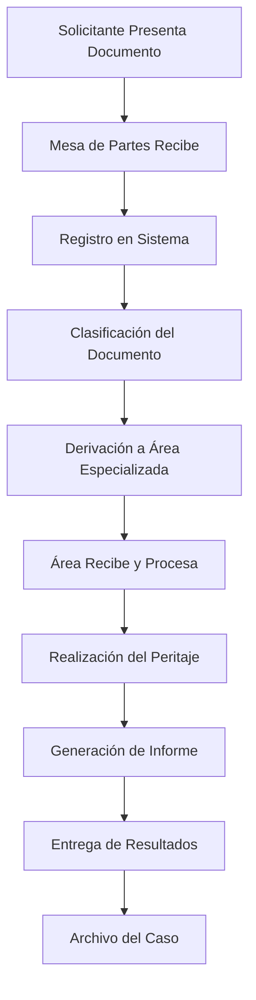

# Flujos de Trabajo - Sistema OFICRI

## Introducción

Este documento describe los procesos de negocio y flujos de trabajo del Sistema OFICRI. Define cómo se procesan los documentos desde su recepción hasta la emisión de informes periciales, incluyendo todos los actores involucrados y las reglas de negocio aplicables.

## Actores del Sistema

### 👥 Roles Principales

#### 1. Mesa de Partes
- **Responsabilidad**: Recepción y derivación inicial de documentos
- **Permisos**: Crear, Editar, Ver, Derivar, Exportar
- **Ámbito**: Todos los documentos entrantes al sistema

#### 2. Responsable de Área Especializada
- **Responsabilidad**: Procesamiento de peritajes especializados
- **Permisos**: Crear, Editar, Ver, Derivar, Exportar
- **Ámbito**: Documentos de su área específica

#### 3. Administrador del Sistema
- **Responsabilidad**: Gestión completa del sistema y usuarios
- **Permisos**: Todos los permisos (bits 0-7)
- **Ámbito**: Todo el sistema

#### 4. Solicitante Externo
- **Responsabilidad**: Presentar solicitudes de peritajes
- **Interacción**: A través de Mesa de Partes
- **Ámbito**: Consulta de estado de sus solicitudes

## Flujo Principal de Documentos

### 📋 Proceso General

### 🔄 Estados del Documento

| Estado | Descripción | Actor Responsable | Acciones Disponibles |
|--------|-------------|-------------------|---------------------|
| **RECIBIDO** | Documento ingresado al sistema | Mesa de Partes | Editar, Derivar |
| **DERIVADO** | Enviado a área especializada | Mesa de Partes | Ver, Seguimiento |
| **EN_PROCESO** | Siendo procesado por área | Área Especializada | Editar, Actualizar Estado |
| **OBSERVADO** | Requiere información adicional | Área Especializada | Solicitar Aclaración |
| **ANALISIS_COMPLETADO** | Peritaje finalizado | Área Especializada | Generar Informe |
| **FINALIZADO** | Informe entregado | Área Especializada | Archivar |
| **ARCHIVADO** | Caso cerrado | Sistema | Solo Consulta |

## Flujos Específicos por Área

### 🧪 Flujo de Dosaje

#### Proceso Detallado

1. **Recepción de Solicitud**
   - Mesa de Partes recibe oficio con solicitud de dosaje
   - Verifica documentación requerida
   - Registra en sistema con tipo "DOSAJE"

2. **Derivación a Área de Dosaje**
   - Selecciona área "Dosaje" como destino
   - Agrega observaciones sobre tipo de análisis requerido
   - Sistema notifica al área receptora

3. **Recepción en Área de Dosaje**
   - Responsable de área confirma recepción
   - Evalúa viabilidad del análisis solicitado
   - Programa fecha de toma de muestra (si aplica)

4. **Procesamiento de Muestra**
   - Recepción de muestra biológica
   - Verificación de cadena de custodia
   - Registro de características de la muestra
   - Asignación de código interno de laboratorio

5. **Análisis de Laboratorio**
   - Preparación de muestra según protocolo
   - Ejecución de análisis con equipos calibrados
   - Registro de resultados en sistema
   - Validación con controles de calidad

6. **Generación de Informe**
   - Interpretación técnica de resultados
   - Redacción de conclusiones
   - Revisión por supervisor (si aplica)
   - Generación de informe pericial en PDF

7. **Entrega de Resultados**
   - Notificación al solicitante
   - Entrega física o digital del informe
   - Actualización de estado a "FINALIZADO"

#### Tipos de Análisis de Dosaje

**Dosaje Etílico**
- **Tiempo estimado**: 2-4 horas
- **Muestra requerida**: Sangre (5ml)
- **Método**: Cromatografía de gases
- **Resultado**: Concentración en g/L

**Dosaje Toxicológico**
- **Tiempo estimado**: 24-48 horas
- **Muestra requerida**: Orina (50ml) o sangre (10ml)
- **Método**: ELISA + confirmación GC-MS
- **Resultado**: Cualitativo (Positivo/Negativo)

**Análisis de Sustancias**
- **Tiempo estimado**: 4-8 horas
- **Muestra requerida**: Sustancia sólida (1g mínimo)
- **Método**: FTIR + GC-MS
- **Resultado**: Identificación y pureza

### 💻 Flujo de Forense Digital

#### Proceso Detallado

1. **Recepción de Solicitud**
   - Mesa de Partes recibe oficio con solicitud de peritaje digital
   - Verifica que se incluya descripción del delito investigado
   - Registra con tipo "FORENSE_DIGITAL"

2. **Derivación a Área de Forense Digital**
   - Especifica tipo de dispositivo a analizar
   - Incluye información sobre el delito investigado
   - Establece prioridad según urgencia del caso

3. **Recepción de Evidencia Digital**
   - Recepción física del dispositivo
   - Documentación fotográfica del estado inicial
   - Verificación de cadena de custodia
   - Registro de características técnicas

4. **Análisis Preliminar**
   - Evaluación del estado del dispositivo
   - Determinación de método de extracción apropiado
   - Estimación de tiempo de procesamiento
   - Solicitud de información adicional si es necesaria

5. **Extracción de Datos**
   - Aplicación de método de extracción seleccionado
   - Generación de imagen forense del dispositivo
   - Verificación de integridad con hash MD5/SHA256
   - Documentación del proceso de extracción

6. **Análisis de Información**
   - Indexación de datos extraídos
   - Búsqueda de información relevante al caso
   - Análisis de comunicaciones y actividad
   - Correlación temporal de eventos

7. **Elaboración de Informe**
   - Descripción técnica del dispositivo
   - Metodología empleada en la extracción
   - Hallazgos relevantes al caso
   - Conclusiones técnicas y recomendaciones

8. **Entrega de Resultados**
   - Informe pericial técnico
   - Evidencia digital en formato forense
   - Presentación de hallazgos (si se requiere)

#### Tipos de Peritajes Forenses

**Extracción de Datos Móviles**
- **Tiempo estimado**: 4-24 horas
- **Información extraída**: Contactos, mensajes, llamadas, fotos, ubicaciones
- **Herramientas**: Cellebrite UFED, Oxygen Forensic
- **Formato de entrega**: Reporte PDF + evidencia digital

**Análisis de Computadoras**
- **Tiempo estimado**: 1-7 días
- **Información extraída**: Archivos, historial web, correos, programas
- **Herramientas**: EnCase, FTK, Autopsy
- **Formato de entrega**: Reporte técnico + imagen forense

**Recuperación de Datos**
- **Tiempo estimado**: 2-14 días
- **Información extraída**: Archivos eliminados, particiones dañadas
- **Herramientas**: R-Studio, PhotoRec, Recuva
- **Formato de entrega**: Archivos recuperados + informe técnico

## Flujos de Excepción

### ⚠️ Documentos Observados

#### Proceso de Observación

1. **Identificación de Problema**
   - Área especializada identifica información faltante
   - Documenta específicamente qué se requiere
   - Cambia estado a "OBSERVADO"

2. **Notificación a Mesa de Partes**
   - Sistema genera notificación automática
   - Mesa de Partes recibe detalle de observaciones
   - Se programa contacto con solicitante

3. **Contacto con Solicitante**
   - Mesa de Partes contacta al solicitante
   - Explica información adicional requerida
   - Establece plazo para subsanar observaciones

4. **Subsanación de Observaciones**
   - Solicitante proporciona información faltante
   - Mesa de Partes actualiza documento en sistema
   - Re-deriva a área especializada

5. **Continuación del Proceso**
   - Área especializada verifica subsanación
   - Continúa con procesamiento normal
   - Actualiza estado según corresponda

#### Tipos de Observaciones Comunes

**Documentación Incompleta**
- Falta de oficio oficial
- Ausencia de identificación del solicitante
- Información insuficiente sobre el caso

**Muestras Inadecuadas**
- Cantidad insuficiente de muestra
- Muestra en mal estado de conservación
- Cadena de custodia incompleta

**Información Técnica Faltante**
- Especificaciones técnicas del dispositivo
- Contraseñas o códigos de acceso
- Contexto del delito investigado

### 🔄 Derivaciones Múltiples

#### Proceso de Re-derivación

1. **Evaluación de Competencia**
   - Área receptora evalúa si el caso corresponde a su especialidad
   - Identifica área más apropiada si no es de su competencia
   - Documenta razones de la re-derivación

2. **Re-derivación Justificada**
   - Selecciona nueva área destino
   - Incluye observaciones detalladas sobre el motivo
   - Mantiene trazabilidad completa del movimiento

3. **Notificación de Cambio**
   - Sistema notifica a Mesa de Partes sobre el cambio
   - Nueva área recibe notificación de asignación
   - Solicitante es informado del cambio (opcional)

#### Casos de Re-derivación Típicos

**Entre Áreas Especializadas**
- Dosaje → Forense Digital: Casos que requieren análisis de dispositivos
- Forense Digital → Dosaje: Hallazgos que requieren análisis químico
- Cualquier área → Mesa de Partes: Casos fuera de competencia

### ⏰ Gestión de Urgencias

#### Clasificación de Urgencia

| Nivel | Descripción | Tiempo de Respuesta | Notificaciones |
|-------|-------------|-------------------|----------------|
| **NORMAL** | Casos regulares | 15-30 días | Estándar |
| **URGENTE** | Casos con plazo judicial | 7-15 días | Diarias |
| **MUY_URGENTE** | Flagrancia, casos críticos | 24-72 horas | Inmediatas |

#### Proceso de Casos Urgentes

1. **Identificación de Urgencia**
   - Mesa de Partes evalúa urgencia según criterios establecidos
   - Marca documento con nivel de prioridad apropiado
   - Registra justificación de la urgencia

2. **Derivación Prioritaria**
   - Notificación inmediata al área especializada
   - Contacto telefónico adicional si es MUY_URGENTE
   - Seguimiento cada 2 horas hasta confirmación de recepción

3. **Procesamiento Acelerado**
   - Área especializada prioriza el caso
   - Asigna recursos adicionales si es necesario
   - Reporta avances cada 24 horas

4. **Seguimiento Intensivo**
   - Mesa de Partes hace seguimiento diario
   - Administrador recibe reportes de casos urgentes
   - Escalamiento automático si se exceden tiempos

## Reglas de Negocio

### 📋 Reglas Generales

#### RN001: Unicidad de Registros
- Cada documento debe tener un número de registro único
- No se permiten duplicados de número de oficio en el mismo año
- El sistema genera automáticamente números de registro secuenciales

#### RN002: Trazabilidad Obligatoria
- Todos los movimientos de documentos deben quedar registrados
- Cada cambio de estado debe incluir observaciones
- La cadena de custodia debe mantenerse íntegra

#### RN003: Permisos por Área
- Los usuarios solo pueden ver documentos de su área asignada
- Los administradores tienen acceso global
- Mesa de Partes puede ver todos los documentos en tránsito

#### RN004: Tiempos de Respuesta
- Casos normales: máximo 30 días calendario
- Casos urgentes: máximo 15 días calendario
- Casos muy urgentes: máximo 72 horas

### 🔒 Reglas de Seguridad

#### RN005: Autenticación Obligatoria
- Todos los accesos deben estar autenticados con CIP
- Las sesiones expiran después de 24 horas de inactividad
- Se registran todos los intentos de acceso (exitosos y fallidos)

#### RN006: Auditoría Completa
- Todas las acciones críticas quedan registradas en logs
- Los logs incluyen: usuario, fecha/hora, IP, acción realizada
- Los logs son inmutables y no pueden ser modificados

#### RN007: Integridad de Datos
- Los documentos finalizados no pueden ser modificados
- Los cambios en documentos activos requieren justificación
- Se mantiene historial de todas las versiones

### 📊 Reglas de Reportes

#### RN008: Confidencialidad
- Los reportes solo incluyen información autorizada para cada rol
- Los datos personales se muestran solo a usuarios autorizados
- Las exportaciones quedan registradas en auditoría

#### RN009: Formatos Estándar
- Los informes periciales siguen plantillas establecidas
- Los reportes estadísticos usan formatos predefinidos
- Las exportaciones incluyen metadatos de trazabilidad

## Indicadores de Rendimiento (KPIs)

### 📈 Métricas Operativas

#### Tiempo de Procesamiento
- **Tiempo promedio de derivación**: < 2 horas desde recepción
- **Tiempo promedio de procesamiento por área**:
  - Dosaje: 3-5 días hábiles
  - Forense Digital: 7-15 días hábiles
- **Tiempo de respuesta a observaciones**: < 24 horas

#### Productividad
- **Documentos procesados por día**: Mínimo 10 por área
- **Tasa de documentos observados**: < 15%
- **Tasa de re-derivaciones**: < 5%

#### Calidad
- **Satisfacción del usuario**: > 4.0/5.0
- **Errores en informes**: < 2%
- **Tiempo de corrección de errores**: < 48 horas

### 📊 Métricas de Sistema

#### Disponibilidad
- **Uptime del sistema**: > 99.5%
- **Tiempo de respuesta promedio**: < 2 segundos
- **Disponibilidad de base de datos**: > 99.9%

#### Seguridad
- **Intentos de acceso no autorizado**: 0 exitosos
- **Tiempo de detección de anomalías**: < 5 minutos
- **Tiempo de respuesta a incidentes**: < 1 hora

## Procedimientos de Contingencia

### 🚨 Fallas del Sistema

#### Procedimiento de Respaldo Manual
1. **Activación del protocolo**: Cuando el sistema no está disponible
2. **Registro manual**: Uso de formularios físicos temporales
3. **Comunicación**: Notificación a todas las áreas afectadas
4. **Recuperación**: Ingreso de datos manuales al sistema una vez restaurado

#### Escalamiento de Incidentes
1. **Nivel 1**: Problemas menores (< 1 hora de impacto)
2. **Nivel 2**: Problemas moderados (1-4 horas de impacto)
3. **Nivel 3**: Problemas críticos (> 4 horas de impacto)

### 📋 Casos Especiales

#### Documentos de Flagrancia
- **Procesamiento inmediato**: Máximo 2 horas para derivación
- **Notificación especial**: Contacto telefónico directo
- **Seguimiento continuo**: Reportes cada 4 horas

#### Casos con Orden Judicial
- **Prioridad máxima**: Procesamiento antes que casos urgentes
- **Documentación especial**: Registro de número de expediente judicial
- **Plazos judiciales**: Cumplimiento estricto de fechas establecidas

---

**Nota**: Estos flujos de trabajo están diseñados para garantizar la eficiencia, trazabilidad y calidad en el procesamiento de todos los casos que ingresan al Sistema OFICRI. Cualquier modificación a estos procesos debe ser aprobada por la dirección y documentada apropiadamente.