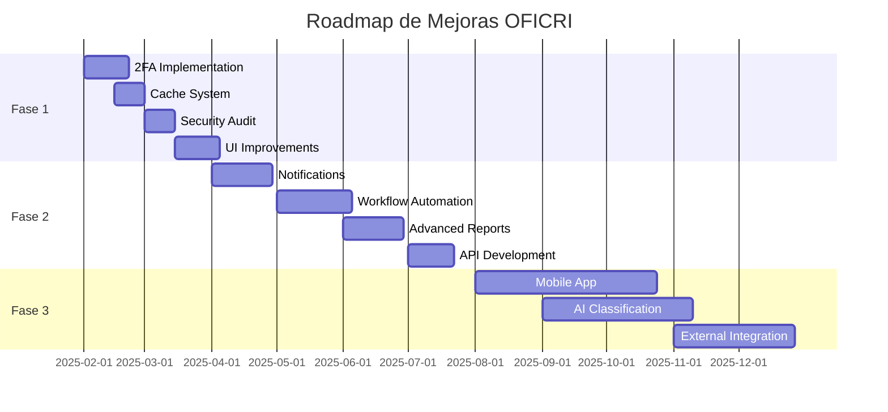

# Plan de Mejoras Futuras - Sistema OFICRI

## Introducción

Este documento presenta el roadmap de mejoras y nuevas funcionalidades planificadas para el Sistema OFICRI. Las mejoras están organizadas por prioridad y plazo de implementación, enfocándose en fortalecer la seguridad, optimizar el rendimiento y ampliar funcionalidades.

## Objetivos Estratégicos

### 🎯 Objetivos Principales

1. **Fortalecer la Seguridad**: Implementar medidas adicionales de ciberseguridad
2. **Optimizar el Rendimiento**: Mejorar tiempos de respuesta y escalabilidad
3. **Ampliar Funcionalidades**: Agregar nuevas capacidades operativas
4. **Mejorar la Experiencia de Usuario**: Interfaces más intuitivas y eficientes
5. **Garantizar la Continuidad**: Asegurar disponibilidad y recuperación ante desastres

## Roadmap de Mejoras

### 📅 Fase 1: Corto Plazo (1-3 meses)

#### 🔒 Mejoras de Seguridad

**1.1 Autenticación Multifactor (2FA)**
- **Descripción**: Implementar segundo factor de autenticación
- **Tecnologías**: TOTP (Google Authenticator), SMS
- **Beneficios**: Reducir riesgo de accesos no autorizados
- **Esfuerzo**: 2-3 semanas
- **Prioridad**: Alta

```javascript
// Ejemplo de implementación 2FA
const speakeasy = require('speakeasy');

const generate2FASecret = (user) => {
  return speakeasy.generateSecret({
    name: `OFICRI (${user.CodigoCIP})`,
    issuer: 'Sistema OFICRI'
  });
};

const verify2FA = (token, secret) => {
  return speakeasy.totp.verify({
    secret: secret,
    encoding: 'base32',
    token: token,
    window: 2
  });
};
```

**1.2 Encriptación de Datos Sensibles**
- **Descripción**: Encriptar datos personales en base de datos
- **Tecnologías**: AES-256, bcrypt para contraseñas
- **Campos a encriptar**: Nombres, apellidos, documentos de identidad
- **Esfuerzo**: 1-2 semanas
- **Prioridad**: Alta

**1.3 Auditoría Avanzada**
- **Descripción**: Logs detallados de todas las operaciones críticas
- **Características**:
  - Logs inmutables con hash de verificación
  - Alertas automáticas por actividades sospechosas
  - Dashboard de monitoreo de seguridad en tiempo real
- **Esfuerzo**: 2 semanas
- **Prioridad**: Media

#### ⚡ Optimización de Rendimiento

**1.4 Implementación de Cache**
- **Descripción**: Sistema de cache para consultas frecuentes
- **Tecnología**: Redis
- **Beneficios**: Reducir carga en base de datos, mejorar tiempos de respuesta
- **Esfuerzo**: 1-2 semanas
- **Prioridad**: Alta

```javascript
// Ejemplo de implementación de cache
const redis = require('redis');
const client = redis.createClient();

const cacheMiddleware = (duration = 300) => {
  return async (req, res, next) => {
    const key = `cache:${req.originalUrl}`;
    const cached = await client.get(key);
    
    if (cached) {
      return res.json(JSON.parse(cached));
    }
    
    res.sendResponse = res.json;
    res.json = (body) => {
      client.setex(key, duration, JSON.stringify(body));
      res.sendResponse(body);
    };
    
    next();
  };
};
```

**1.5 Optimización de Consultas SQL**
- **Descripción**: Análisis y optimización de consultas lentas
- **Acciones**:
  - Identificar consultas N+1
  - Agregar índices estratégicos
  - Implementar paginación eficiente
  - Optimizar JOINs complejos
- **Esfuerzo**: 1 semana
- **Prioridad**: Media

#### 🎨 Mejoras de UI/UX

**1.6 Interfaz Responsive Mejorada**
- **Descripción**: Optimización para dispositivos móviles
- **Características**:
  - Diseño mobile-first
  - Componentes táctiles optimizados
  - Navegación simplificada en móviles
- **Esfuerzo**: 2-3 semanas
- **Prioridad**: Media

**1.7 Dashboard Interactivo**
- **Descripción**: Panel de control con gráficos y métricas en tiempo real
- **Tecnologías**: Chart.js, D3.js
- **Características**:
  - Gráficos de productividad por área
  - Métricas de tiempo de procesamiento
  - Alertas visuales de documentos urgentes
- **Esfuerzo**: 2 semanas
- **Prioridad**: Media

### 📅 Fase 2: Mediano Plazo (3-6 meses)

#### 🚀 Nuevas Funcionalidades

**2.1 Sistema de Notificaciones**
- **Descripción**: Notificaciones en tiempo real para usuarios
- **Tecnologías**: WebSockets, Push Notifications
- **Características**:
  - Notificaciones de documentos asignados
  - Alertas de vencimientos
  - Notificaciones de cambios de estado
- **Esfuerzo**: 3-4 semanas
- **Prioridad**: Alta

```javascript
// Ejemplo de WebSocket para notificaciones
const io = require('socket.io')(server);

io.on('connection', (socket) => {
  socket.on('join-area', (areaId) => {
    socket.join(`area-${areaId}`);
  });
});

const notifyArea = (areaId, notification) => {
  io.to(`area-${areaId}`).emit('notification', notification);
};
```

**2.2 Workflow Automatizado**
- **Descripción**: Automatización de procesos repetitivos
- **Características**:
  - Derivación automática basada en reglas
  - Recordatorios automáticos de vencimientos
  - Escalamiento automático de casos urgentes
- **Esfuerzo**: 4-5 semanas
- **Prioridad**: Alta

**2.3 Generador de Reportes Avanzado**
- **Descripción**: Sistema flexible de generación de reportes
- **Características**:
  - Constructor visual de reportes
  - Exportación en múltiples formatos (PDF, Excel, CSV)
  - Reportes programados automáticos
  - Gráficos y visualizaciones personalizables
- **Esfuerzo**: 3-4 semanas
- **Prioridad**: Media

**2.4 API Pública para Integraciones**
- **Descripción**: API REST documentada para integraciones externas
- **Características**:
  - Documentación con Swagger/OpenAPI
  - Rate limiting por cliente
  - Autenticación por API keys
  - Webhooks para eventos importantes
- **Esfuerzo**: 2-3 semanas
- **Prioridad**: Media

#### 🔧 Mejoras Técnicas

**2.5 Testing Automatizado**
- **Descripción**: Suite completa de pruebas automatizadas
- **Tecnologías**: Jest, Cypress, Supertest
- **Cobertura**:
  - Unit tests para lógica de negocio
  - Integration tests para APIs
  - E2E tests para flujos críticos
- **Esfuerzo**: 4-5 semanas
- **Prioridad**: Alta

**2.6 CI/CD Pipeline**
- **Descripción**: Pipeline de integración y despliegue continuo
- **Tecnologías**: GitHub Actions, Docker
- **Características**:
  - Tests automáticos en cada commit
  - Despliegue automático a staging
  - Rollback automático en caso de errores
- **Esfuerzo**: 2-3 semanas
- **Prioridad**: Media

### 📅 Fase 3: Largo Plazo (6-12 meses)

#### 🤖 Inteligencia Artificial y Machine Learning

**3.1 Clasificación Automática de Documentos**
- **Descripción**: IA para clasificar y derivar documentos automáticamente
- **Tecnologías**: TensorFlow.js, Natural Language Processing
- **Características**:
  - Análisis de contenido de documentos
  - Sugerencias de área de derivación
  - Detección de urgencia automática
- **Esfuerzo**: 8-10 semanas
- **Prioridad**: Media

**3.2 Análisis Predictivo**
- **Descripción**: Predicción de tiempos de procesamiento y carga de trabajo
- **Características**:
  - Predicción de tiempos de finalización
  - Análisis de tendencias de casos
  - Optimización de asignación de recursos
- **Esfuerzo**: 6-8 semanas
- **Prioridad**: Baja

#### 📱 Aplicación Móvil

**3.3 App Móvil Nativa**
- **Descripción**: Aplicación móvil para consultas y operaciones básicas
- **Tecnologías**: React Native o Flutter
- **Características**:
  - Consulta de estado de documentos
  - Notificaciones push
  - Captura de fotos para evidencia
  - Funcionalidad offline básica
- **Esfuerzo**: 10-12 semanas
- **Prioridad**: Media

#### 🔗 Integraciones Avanzadas

**3.4 Integración con Sistemas Externos**
- **Descripción**: Conectores con sistemas policiales existentes
- **Sistemas objetivo**:
  - RENIEC (verificación de identidad)
  - SUNAT (consultas tributarias)
  - Poder Judicial (seguimiento de casos)
- **Esfuerzo**: 8-10 semanas
- **Prioridad**: Alta

**3.5 Blockchain para Trazabilidad**
- **Descripción**: Registro inmutable de la cadena de custodia
- **Tecnologías**: Hyperledger Fabric, Ethereum
- **Beneficios**:
  - Trazabilidad inmutable de evidencias
  - Verificación criptográfica de integridad
  - Auditoría transparente
- **Esfuerzo**: 12-15 semanas
- **Prioridad**: Baja

### 📅 Fase 4: Futuro Extendido (1-2 años)

#### 🏗️ Arquitectura Avanzada

**4.1 Microservicios**
- **Descripción**: Migración a arquitectura de microservicios
- **Servicios propuestos**:
  - Servicio de autenticación
  - Servicio de documentos
  - Servicio de notificaciones
  - Servicio de reportes
- **Beneficios**: Escalabilidad, mantenibilidad, despliegues independientes
- **Esfuerzo**: 20-25 semanas
- **Prioridad**: Media

**4.2 Contenedorización con Docker**
- **Descripción**: Migración completa a contenedores
- **Tecnologías**: Docker, Kubernetes
- **Beneficios**: Portabilidad, escalabilidad automática, gestión simplificada
- **Esfuerzo**: 8-10 semanas
- **Prioridad**: Media

#### 🌐 Capacidades Avanzadas

**4.3 Análisis Forense Automatizado**
- **Descripción**: Herramientas de análisis forense integradas
- **Características**:
  - Análisis automático de metadatos
  - Detección de manipulación de imágenes
  - Extracción automática de datos de dispositivos
- **Esfuerzo**: 15-20 semanas
- **Prioridad**: Alta

**4.4 Realidad Aumentada para Evidencias**
- **Descripción**: Visualización AR de escenas del crimen
- **Tecnologías**: WebXR, Three.js
- **Características**:
  - Reconstrucción 3D de escenas
  - Anotaciones en realidad aumentada
  - Visualización inmersiva de evidencias
- **Esfuerzo**: 20-25 semanas
- **Prioridad**: Baja

## Criterios de Priorización

### 🎯 Matriz de Priorización

| Criterio | Peso | Descripción |
|----------|------|-------------|
| **Impacto en Seguridad** | 30% | Mejoras que fortalecen la seguridad del sistema |
| **Beneficio Operativo** | 25% | Mejoras que optimizan procesos existentes |
| **Facilidad de Implementación** | 20% | Complejidad técnica y tiempo requerido |
| **Demanda de Usuarios** | 15% | Solicitudes y necesidades reportadas |
| **Costo-Beneficio** | 10% | Relación entre inversión y retorno |

### 📊 Evaluación de Mejoras

#### Alta Prioridad
- Autenticación Multifactor (2FA)
- Sistema de Cache con Redis
- Sistema de Notificaciones
- Testing Automatizado
- Integración con Sistemas Externos

#### Media Prioridad
- Encriptación de Datos Sensibles
- Dashboard Interactivo
- API Pública
- Aplicación Móvil
- Microservicios

#### Baja Prioridad
- Análisis Predictivo con IA
- Blockchain para Trazabilidad
- Realidad Aumentada

## Recursos Necesarios

### 👥 Equipo de Desarrollo

**Roles Requeridos**:
- **1 Tech Lead**: Arquitectura y coordinación técnica
- **2 Desarrolladores Full-Stack**: Frontend y Backend
- **1 Especialista en Seguridad**: Implementación de medidas de seguridad
- **1 DevOps Engineer**: CI/CD y infraestructura
- **1 QA Engineer**: Testing y calidad

### 💰 Estimación de Costos

#### Fase 1 (1-3 meses)
- **Desarrollo**: 3 desarrolladores × 3 meses = 9 persona-mes
- **Infraestructura**: Servidores adicionales, herramientas
- **Costo estimado**: $45,000 - $60,000

#### Fase 2 (3-6 meses)
- **Desarrollo**: 4 desarrolladores × 3 meses = 12 persona-mes
- **Herramientas**: Licencias de software, servicios cloud
- **Costo estimado**: $60,000 - $80,000

#### Fase 3 (6-12 meses)
- **Desarrollo**: 5 desarrolladores × 6 meses = 30 persona-mes
- **Investigación**: IA/ML, tecnologías emergentes
- **Costo estimado**: $150,000 - $200,000

### 🛠️ Herramientas y Tecnologías

#### Nuevas Tecnologías a Incorporar
- **Redis**: Cache y sesiones
- **Socket.io**: Comunicación en tiempo real
- **Docker**: Contenedorización
- **Jest/Cypress**: Testing automatizado
- **TensorFlow.js**: Machine Learning
- **React Native/Flutter**: Desarrollo móvil

#### Servicios Cloud
- **AWS/Azure**: Infraestructura cloud
- **CDN**: Distribución de contenido
- **Monitoring**: New Relic, DataDog
- **Backup**: Servicios de respaldo automático

## Métricas de Éxito

### 📈 KPIs Técnicos

**Rendimiento**
- Tiempo de respuesta < 200ms (95% de requests)
- Disponibilidad > 99.9%
- Tiempo de carga de páginas < 2 segundos

**Seguridad**
- 0 vulnerabilidades críticas
- 100% de accesos con 2FA
- Tiempo de detección de intrusiones < 5 minutos

**Calidad**
- Cobertura de tests > 80%
- 0 bugs críticos en producción
- Tiempo de resolución de bugs < 24 horas

### 📊 KPIs de Negocio

**Productividad**
- Reducción del 30% en tiempo de procesamiento
- Aumento del 50% en documentos procesados por día
- Reducción del 40% en errores de derivación

**Satisfacción del Usuario**
- Puntuación de satisfacción > 4.5/5
- Reducción del 60% en consultas de soporte
- Tiempo de capacitación de nuevos usuarios < 2 horas

## Gestión de Riesgos

### ⚠️ Riesgos Identificados

#### Riesgos Técnicos
- **Complejidad de migración**: Riesgo de interrupciones durante actualizaciones
- **Compatibilidad**: Problemas con sistemas legacy
- **Escalabilidad**: Limitaciones de infraestructura actual

#### Riesgos de Proyecto
- **Recursos limitados**: Falta de desarrolladores especializados
- **Cambios de requerimientos**: Modificaciones durante desarrollo
- **Dependencias externas**: Retrasos en integraciones con terceros

### 🛡️ Estrategias de Mitigación

#### Técnicas
- **Desarrollo incremental**: Implementación por fases
- **Testing exhaustivo**: Pruebas en ambiente de staging
- **Rollback automático**: Capacidad de revertir cambios

#### Organizacionales
- **Capacitación continua**: Actualización de habilidades del equipo
- **Documentación detallada**: Manuales y guías técnicas
- **Comunicación regular**: Reuniones de seguimiento semanales

## Cronograma de Implementación

### 📅 Timeline Detallado



## Conclusiones y Recomendaciones

### 🎯 Recomendaciones Prioritarias

1. **Comenzar con seguridad**: Implementar 2FA y encriptación como primera prioridad
2. **Optimizar rendimiento**: Cache y optimización de consultas para mejorar experiencia
3. **Automatizar procesos**: Reducir trabajo manual con workflows automatizados
4. **Preparar para el futuro**: Establecer bases para IA y análisis avanzado

### 📋 Próximos Pasos

1. **Aprobación del plan**: Revisión y aprobación por stakeholders
2. **Asignación de recursos**: Confirmación de equipo y presupuesto
3. **Inicio de Fase 1**: Comenzar con mejoras de seguridad y rendimiento
4. **Establecer métricas**: Implementar sistema de monitoreo de KPIs

---

**Nota**: Este plan de mejoras es un documento vivo que debe actualizarse regularmente basándose en feedback de usuarios, cambios tecnológicos y nuevas necesidades operativas del sistema OFICRI.